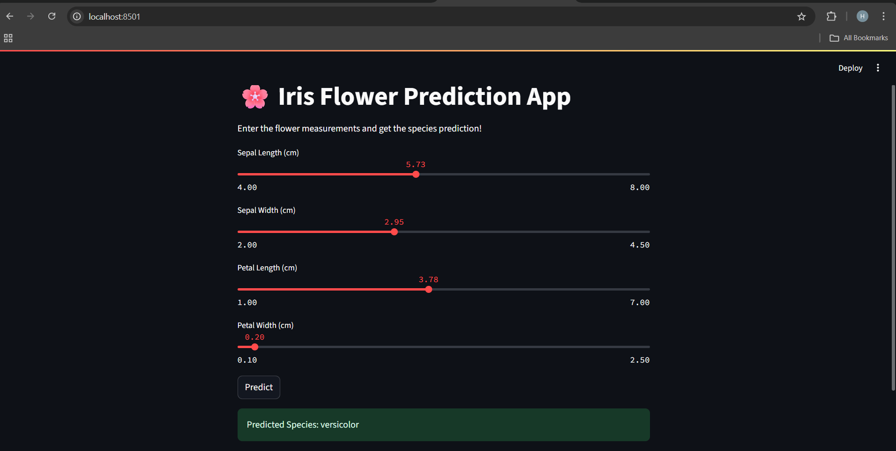

# 🌸 Iris Flower Prediction App

A simple **Streamlit web application** that predicts the species of an iris flower based on user-inputted measurements. This app uses a **Random Forest Classifier** trained on the famous Iris dataset.

---

## 📌 Project Overview
This application demonstrates how to:
- Build an interactive **data science app** using **Streamlit**.
- Train a **Machine Learning model** with scikit-learn.
- Provide a user-friendly interface for real-time predictions.

---

## ✅ Features
- Interactive sliders for inputting flower measurements.
- Predicts species: **Setosa**, **Versicolor**, or **Virginica**.
- Clean and lightweight interface using **Streamlit**.

---

## 📂 Project Structure
iris-flower-prediction-app/<br>
│<br>
├── iris_app.py # Main application code<br>
├── requirements.txt # Required dependencies<br>
└── README.md # Project documentation<br>

---

## 🔧 Installation and Setup
### 1. Clone the Repository
```bash
git clone https://code.swecha.org/HariniReddyKunta/iris-flower-prediction-app.git
cd iris-flower-prediction-app
```
## 2. Create Virtual Environment (Optional but Recommended)

```bash
python -m venv venv
source venv/bin/activate    # On Mac/Linux
venv\Scripts\activate       # On Windows
```
## 3. Install Dependencies
```bash
pip install -r requirements.txt

```
## Running App
```bash
streamlit run iris_app.py
```
Then open the link in your browser:
```arduino
http://localhost:8501
```

## Screenshot


## ✅ Technologies Used
- python
- streamlit
- scikit-learn
- pandas
## 👩‍💻 Author
Harini Reddy Kunta
## 📄 .gitignore
```bash
# Python cache
__pycache__/
*.pyc

# Virtual environment
venv/
.env/

# Streamlit cache
.streamlit/

# OS files
.DS_Store
Thumbs.db


# Iris-Flower-Detection-App
